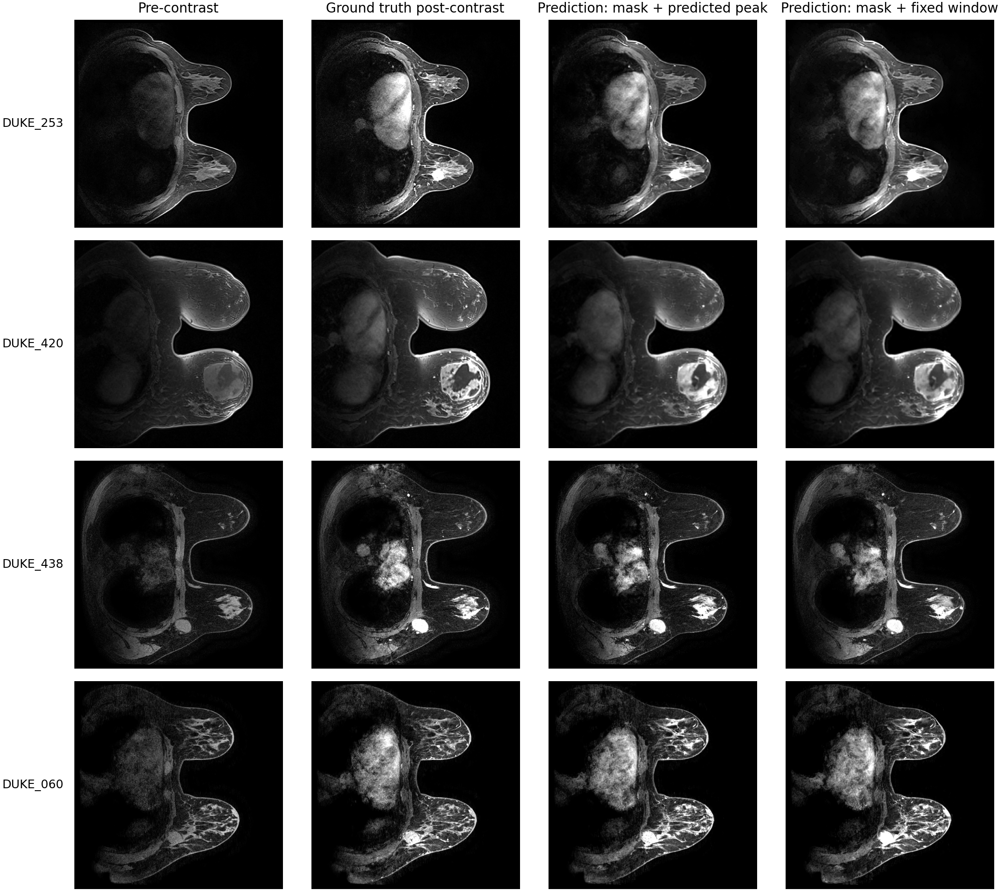

# MAMA-SYNTH LBM

Minimal code for **Pre- to Post-Contrast Synthesis of Breast DCE-MRI using Latent Bridge Matching**.

This repository trains a latent bridge model that starts from a pre-contrast breast MRI latent and iteratively refines it toward a synthetic peak-enhanced post-contrast latent. The release is intentionally small: code lives here; trained weights and Docker images are downloaded separately.



## What Is Included

- Minimal latent-manifest training code for the LBM paper model.
- A submission-style inference runtime for single-slice `.mha`, `.nii`, or `.nii.gz` inputs.
- Docker scaffolding for offline inference once model resources are downloaded.
- A paper figure and citation metadata.

Large assets are not committed. Fill these placeholders after upload:

```text
MODEL_DOWNLOAD_URL=MODEL_DOWNLOAD_URL
DOCKER_IMAGE=DOCKER_IMAGE
DOCKER_TARBALL_URL=DOCKER_TARBALL_URL
```

## Installation

Use Python 3.10 or newer. Install PyTorch for your CUDA version first, then:

```bash
pip install -r requirements.txt
pip install -e .
```

## Train From A Latent Manifest

Training expects a `latent_manifest.csv` whose rows point to `.pt` latent payloads with at least:

```text
image_0_latent
peak_latent
segmentation_latent
patient_id
split
latent_path
```

Run the paper-style source plus tumor-mask LBM:

```bash
bash scripts/train_lbm_latents.sh /path/to/latent_manifest.csv runs/lbm_source_seg
```

By default the script uses DUKE and ISPY2 patient-id prefixes. To train on all rows:

```bash
INCLUDE_DATASETS="" bash scripts/train_lbm_latents.sh /path/to/latent_manifest.csv runs/lbm_all
```

The trainer writes checkpoints as:

```text
runs/lbm_source_seg/
  args.json
  checkpoint_rollout_metrics.csv
  checkpoint-0001000/
    unet/
    scheduler/
    training_state.json
```

## Inference With Released Weights

Download and unpack the model bundle into `resources/` so it matches `resources/README.md`. Then copy or edit the config:

```bash
cp submission_config.example.json submission_config.json
```

Run local inference on one image file:

```bash
bash scripts/infer_slice.sh /path/to/patient.mha /tmp/mama_lbm_output
```

Or run on an already staged input directory:

```bash
MAMA_INPUT_DIR=/path/to/input \
MAMA_OUTPUT_DIR=/path/to/output \
python inference.py
```

The expected staged input layout is:

```text
input/
  images/
    pre-contrast-dce-mri-slice-breast/
      patient.mha
```

Predictions are written to:

```text
output/images/synthetic-contrast-dce-mri-slice-breast/output.mha
```

## Docker

Use a published image:

```bash
docker pull DOCKER_IMAGE
docker run --gpus all \
  -v /path/to/input:/input \
  -v /path/to/output:/output \
  DOCKER_IMAGE
```

Or load a released tarball:

```bash
wget DOCKER_TARBALL_URL -O mama-synth-lbm.tar.gz
docker load < mama-synth-lbm.tar.gz
```

To build locally after downloading `resources/`:

```bash
docker build -t mama-synth-lbm .
```

## Citation

```bibtex
@inproceedings{mamasynth_lbm_2026,
  title = {Pre- to Post-Contrast Synthesis of Breast DCE-MRI using Latent Bridge Matching},
  author = {Anonymous},
  booktitle = {MICCAI},
  year = {2026}
}
```

## License

See `LICENSE`.
