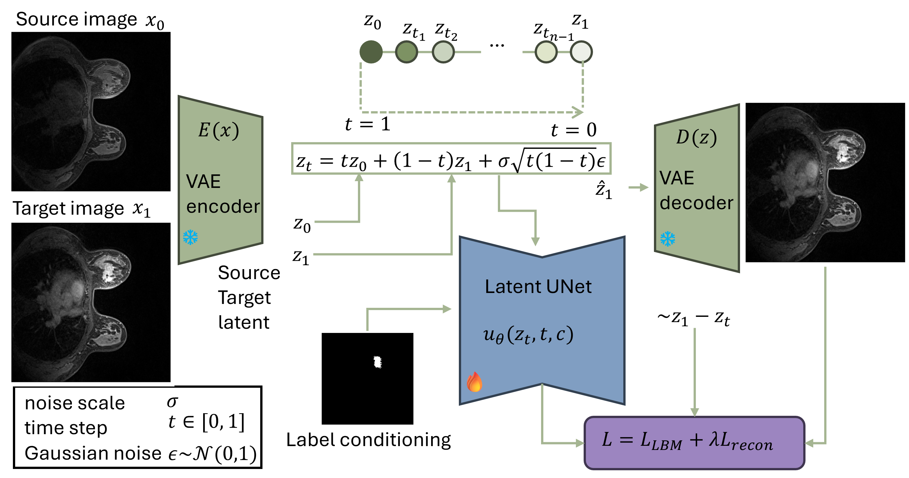
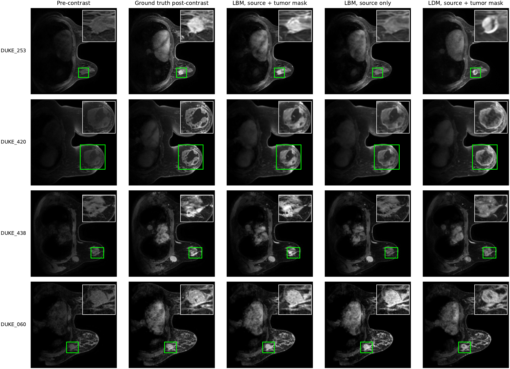

# MAMA-SYNTH LBM 🧬✨

**Latent Bridge Matching for pre- to post-contrast breast DCE-MRI synthesis.**

This repository contains the minimal training and inference code for the MICCAI 2026 paper **Pre- to Post-Contrast Synthesis of Breast DCE-MRI using Latent Bridge Matching** by Sina Amirrajab, Zohaib Sallahuddin, Henry C. Woodruff, and Philippe Lambin.

LBM starts from the observed pre-contrast MRI latent instead of random noise, then progressively transports it toward a peak-enhanced post-contrast latent. The goal is practical virtual contrast enhancement: preserve patient anatomy, model localized enhancement, and keep the release small enough to actually clone.

📄 **Paper:** [MICCAI_2026___MAMA_SYNTH.pdf](resources/MICCAI_2026___MAMA_SYNTH.pdf)

## Method 🧠



The model encodes the pre-contrast source image `x0` and peak-enhanced target image `x1` with a Stable Diffusion VAE. During training, it samples noisy bridge states between the paired source and target latents, then trains a latent UNet to predict the remaining correction toward the target latent. At inference time, only the pre-contrast image is available; the source latent is refined over a decreasing bridge-time schedule and decoded back to image space.

## Qualitative Results 🔍



The paper evaluates LBM on 91 DUKE validation cases from the MAMA-SYNTH setting. Tumor-mask conditioning improves the source-only LBM across the reported validation metrics, and using predicted masks gives a reviewer-facing comparison for a more realistic inference setup.

| Model | MSE ↓ | LPIPS ↓ | Tumor SSIM ↑ | FRD ↓ |
|---|---:|---:|---:|---:|
| LBM, source only | 1.023 ± 1.169 | 0.119 ± 0.035 | 0.355 ± 0.232 | 7.523 |
| LBM, source + tumor mask | 0.940 ± 1.085 | 0.114 ± 0.034 | 0.429 ± 0.185 | 4.716 |
| LBM, source + predicted mask | 0.985 ± 1.128 | 0.115 ± 0.034 | 0.356 ± 0.229 | 5.107 |
| LDM, source + tumor mask | 1.122 ± 1.248 | 0.136 ± 0.037 | 0.322 ± 0.174 | 4.786 |

## What Is Included 📦

- Minimal latent-manifest training code for the LBM paper model.
- A submission-style inference runtime for single-slice `.mha`, `.nii`, or `.nii.gz` inputs.
- Docker scaffolding for offline inference once model resources are downloaded.
- Paper PDF, method figure, qualitative visualization, and citation metadata.

Large model assets are not committed. Fill these placeholders after upload:

```text
MODEL_DOWNLOAD_URL=MODEL_DOWNLOAD_URL
DOCKER_IMAGE=DOCKER_IMAGE
DOCKER_TARBALL_URL=DOCKER_TARBALL_URL
```

## Installation ⚙️

Use Python 3.10 or newer. Install PyTorch for your CUDA version first, then:

```bash
pip install -r requirements.txt
pip install -e .
```

## Train From A Latent Manifest 🚀

Training expects a `latent_manifest.csv` whose rows point to `.pt` latent payloads with at least:

```text
image_0_latent
peak_latent
segmentation_latent
patient_id
split
latent_path
```

Run the paper-style source plus tumor-mask LBM:

```bash
bash scripts/train_lbm_latents.sh /path/to/latent_manifest.csv runs/lbm_source_seg
```

By default the script uses DUKE and ISPY2 patient-id prefixes. To train on all rows:

```bash
INCLUDE_DATASETS="" bash scripts/train_lbm_latents.sh /path/to/latent_manifest.csv runs/lbm_all
```

The trainer writes checkpoints as:

```text
runs/lbm_source_seg/
  args.json
  checkpoint_rollout_metrics.csv
  checkpoint-0001000/
    unet/
    scheduler/
    training_state.json
```

## Inference With Released Weights 🧪

Download and unpack the model bundle into `resources/` so it matches `resources/README.md`. Then copy or edit the config:

```bash
cp submission_config.example.json submission_config.json
```

Run local inference on one image file:

```bash
bash scripts/infer_slice.sh /path/to/patient.mha /tmp/mama_lbm_output
```

Or run on an already staged input directory:

```bash
MAMA_INPUT_DIR=/path/to/input \
MAMA_OUTPUT_DIR=/path/to/output \
python inference.py
```

The expected staged input layout is:

```text
input/
  images/
    pre-contrast-dce-mri-slice-breast/
      patient.mha
```

Predictions are written to:

```text
output/images/synthetic-contrast-dce-mri-slice-breast/output.mha
```

## Docker 🐳

Use a published image:

```bash
docker pull DOCKER_IMAGE
docker run --gpus all \
  -v /path/to/input:/input \
  -v /path/to/output:/output \
  DOCKER_IMAGE
```

Or load a released tarball:

```bash
wget DOCKER_TARBALL_URL -O mama-synth-lbm.tar.gz
docker load < mama-synth-lbm.tar.gz
```

To build locally after downloading `resources/`:

```bash
docker build -t mama-synth-lbm .
```

## Citation 📚

```bibtex
@inproceedings{amirrajab2026mamasynthlbm,
  title = {Pre- to Post-Contrast Synthesis of Breast DCE-MRI using Latent Bridge Matching},
  author = {Amirrajab, Sina and Sallahuddin, Zohaib and Woodruff, Henry C. and Lambin, Philippe},
  booktitle = {MICCAI 2026},
  year = {2026}
}
```

## License 🎓

This code and accompanying paper assets are released for **academic and non-commercial research use only**. They are not licensed for clinical use, commercial use, redistribution as a commercial product, or medical decision-making. See [LICENSE](LICENSE).
